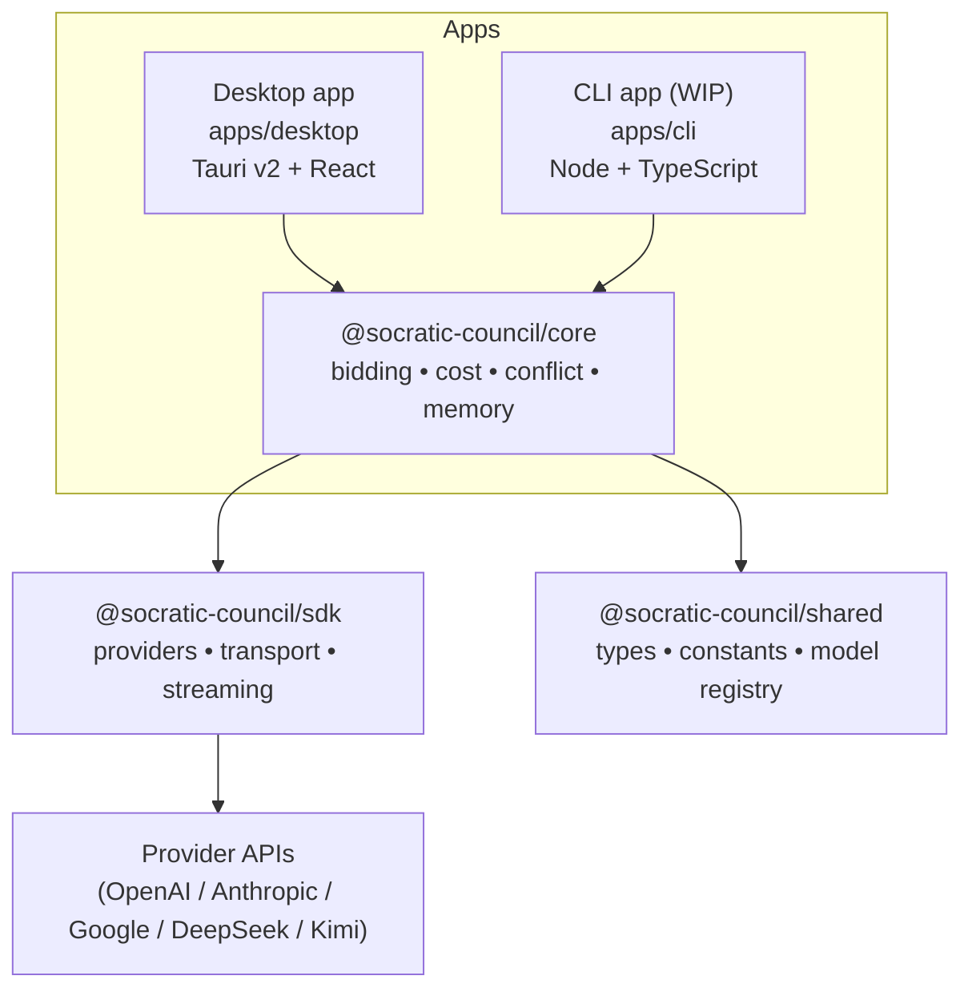
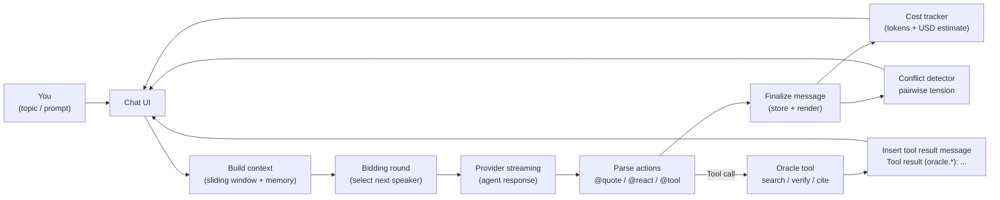
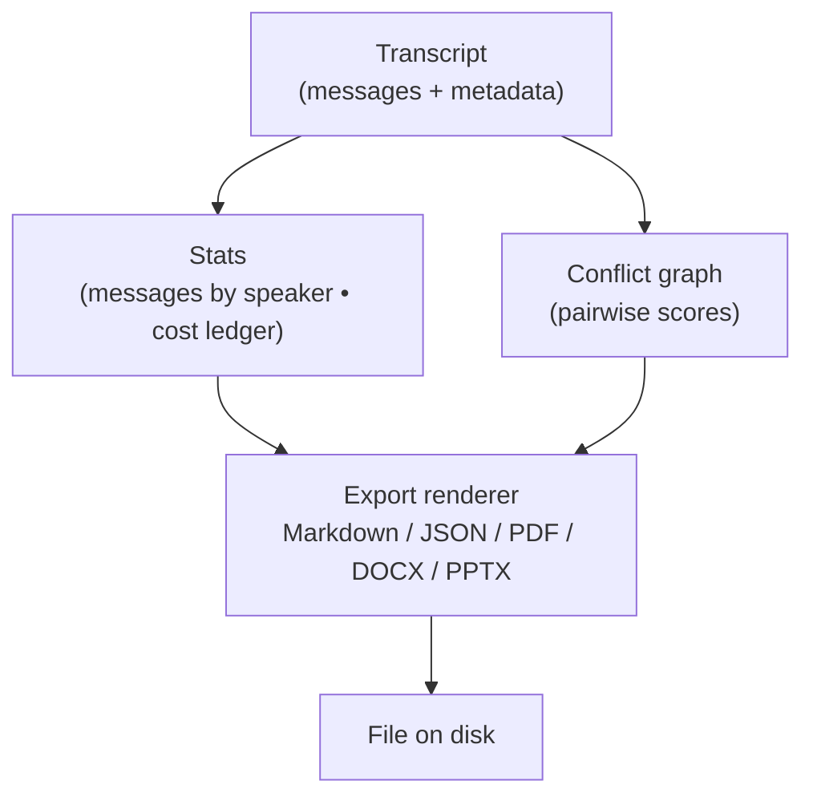

# Socratic Council

Socratic Council is a local-first desktop app that runs a five-agent “seminar” on any topic. You provide one or more AI provider API keys, type a topic, and watch five agents discuss it in a turn-taking group chat. The app includes search, quoting, export, conflict visualization, and token/cost tracking.

This repo currently ships **source only** (no installer downloads). If you can run a Tauri + React project, you can run Socratic Council.

At a glance:
- Local-first: runs on your machine
- Bring-your-own-keys: uses real provider APIs
- Multi-agent: five speakers + optional moderator
- Built-in tools: quoting, reactions, search, export, conflict graph, cost ledger

## Table of contents

- [Quickstart (copy/paste)](#quickstart-copypaste)
- [How it works](#how-it-works)
  - [Architecture](#architecture)
  - [Conversation loop](#conversation-loop)
  - [Export pipeline](#export-pipeline)
- [Prerequisites](#prerequisites)
  - [All platforms](#all-platforms)
  - [macOS prerequisites](#macos-prerequisites)
  - [Windows prerequisites](#windows-prerequisites)
  - [Linux prerequisites](#linux-prerequisites)
- [First run setup](#first-run-setup)
  - [API keys](#api-keys)
  - [Models](#models)
  - [Proxy](#proxy)
  - [Moderator](#moderator)
- [Using the app](#using-the-app)
  - [Home](#home)
  - [Chat](#chat)
  - [Pause, resume, stop](#pause-resume-stop)
  - [Search](#search)
  - [Export](#export)
  - [Logs](#logs)
- [Tool calling (oracle)](#tool-calling-oracle)
- [Troubleshooting](#troubleshooting)
- [Developer workflows](#developer-workflows)
- [Monorepo layout](#monorepo-layout)
- [License](#license)

## Quickstart (copy/paste)

### macOS / Linux (bash/zsh)

```bash
git clone https://github.com/richer-richard/socratic-council-of-five.git
cd socratic-council-of-five
corepack enable
pnpm install
pnpm --filter @socratic-council/desktop tauri:dev
```

### Windows (PowerShell)

```powershell
git clone https://github.com/richer-richard/socratic-council-of-five.git
cd socratic-council-of-five
corepack enable
pnpm install
pnpm --filter @socratic-council/desktop tauri:dev
```

Notes:
- The **first build can take a while** (Rust + frontend dependencies).
- If you hit an error, jump to [Troubleshooting](#troubleshooting) and run the “diagnostics” commands.

## How it works

### Architecture

Socratic Council is a pnpm monorepo with a desktop app and shared TypeScript packages.



### Conversation loop

At runtime the app repeatedly selects a speaker, streams their response, applies structured “actions” in the text, then updates the UI and analytics.



### Export pipeline

Exports are generated locally from the transcript plus computed statistics (speaker counts, tokens, costs, conflict graph).



## Prerequisites

Socratic Council is a Tauri v2 + React app in a pnpm monorepo. You need:
- Node.js (for the frontend/tooling)
- Rust (for Tauri)
- System dependencies (per OS) so Tauri can build native binaries

The official Tauri v2 prerequisite docs are the source of truth:
- [Tauri prerequisites](https://v2.tauri.app/start/prerequisites/)

### All platforms

1) Install **Git**
- Verify:
  - `git --version`

2) Install **Node.js 22+**
- This repo requires Node >= 22 (see `package.json`).
- Verify:
  - `node -v`
  - `corepack -v`

3) Enable **pnpm via corepack**

```bash
corepack enable
pnpm -v
```

4) Install **Rust stable** (via rustup)

macOS / Linux:

```bash
curl --proto '=https' --tlsv1.2 https://sh.rustup.rs -sSf | sh
rustc -V
cargo -V
```

Windows (PowerShell):

```powershell
winget install --id Rustlang.Rustup
rustc -V
cargo -V
```

### macOS prerequisites

1) Install Xcode (or at least Xcode Command Line Tools)
- Install:
  - `xcode-select --install`
- Verify:
  - `xcodebuild -version`

If `tauri:dev` fails with linker or SDK errors, open Xcode once so it can finish setup.

### Windows prerequisites

1) Install **Microsoft C++ Build Tools**
- In the Visual Studio Installer, select:
  - “Desktop development with C++”

2) Ensure **WebView2 Runtime** is installed
- Windows 10 (1803+) / Windows 11 usually already include WebView2.
- If not, install the WebView2 Evergreen Runtime (see Tauri docs):
  - [Tauri prerequisites](https://v2.tauri.app/start/prerequisites/)

3) Ensure Rust is using the MSVC toolchain

```powershell
rustup default stable-msvc
```

### Linux prerequisites

Install system dependencies required by Tauri (examples below; see the Tauri docs for your distro).

Debian/Ubuntu:

```bash
sudo apt update
sudo apt install libwebkit2gtk-4.1-dev \
  build-essential \
  curl \
  wget \
  file \
  libxdo-dev \
  libssl-dev \
  libayatana-appindicator3-dev \
  librsvg2-dev
```

Arch:

```bash
sudo pacman -Syu
sudo pacman -S --needed \
  webkit2gtk-4.1 \
  base-devel \
  curl \
  wget \
  file \
  openssl \
  appmenu-gtk-module \
  libappindicator-gtk3 \
  librsvg \
  xdotool
```

Fedora:

```bash
sudo dnf check-update
sudo dnf install webkit2gtk4.1-devel \
  openssl-devel \
  curl \
  wget \
  file \
  libappindicator-gtk3-devel \
  librsvg2-devel \
  libxdo-devel
sudo dnf group install "c-development"
```

## First run setup

On first launch, configure providers and models in **Settings**.

### API keys

Socratic Council uses real provider APIs (you bring keys). Supported providers include:
- OpenAI
- Anthropic
- Google (Gemini)
- DeepSeek
- Kimi

Where keys are stored:
- The app stores your keys locally (on your machine). This repo does not run a server for you.

### Models

Each provider supports multiple models. The Settings screen lets you choose:
- The default model per provider
- The model used by each agent (optional, depending on the UI configuration)

### Proxy

If you need a proxy (corporate networks, etc.), configure it in Settings. The app uses one global proxy for all providers.

### Moderator

The “Moderator” is a system-role agent that can inject short guidance when tension is detected or when the conversation drifts. You can toggle the Moderator in Settings.

## Using the app

### Home

From the home screen you can:
- Start a new discussion
- Open settings

### Chat

The chat timeline shows:
- Messages by speaker
- Per-message token usage (when available)
- Per-message cost estimate (when available)
- Quotes and reactions

### Pause, resume, stop

During a discussion you can:
- Pause generation
- Resume generation
- Stop the session early

### Search

Search lets you:
- Find text in the transcript
- Jump directly to the matching message in the timeline

### Export

The app can export a conversation to:
- Markdown
- JSON
- PDF
- DOCX
- PPTX

Exports are generated locally.

Format guide:

| Format | Best for | Notes |
|---|---|---|
| Markdown | Sharing in docs/issues | Plain text, easiest to diff |
| JSON | Programmatic processing | Stable schema for tooling |
| PDF | Printing / sending | Includes charts and summaries |
| DOCX | Editing in Word | Structured sections, tables |
| PPTX | Slides / presentation | Graphics-first summary |

### Logs

Logs are intended for debugging provider calls and app behavior. If something looks wrong, logs often explain why.

## Tool calling (oracle)

Agents can request web-style lookup/verification via a built-in “oracle” tool call.

What an agent writes (inside an AI message):

```text
@tool(oracle.search, {"query":"..."})
```

What you see next in the transcript:

```text
Tool result (oracle.search): ...
```

That “Tool result (oracle.search): …” line is not an error. It is a normal message inserted by the app after the oracle tool returns (or returns no results).

## Troubleshooting

### Diagnostics (run these first)

From the repo root:

```bash
node -v
pnpm -v
rustc -V
cargo -V
pnpm --filter @socratic-council/desktop tauri --version
```

On Windows PowerShell:

```powershell
node -v
pnpm -v
rustc -V
cargo -V
pnpm --filter @socratic-council/desktop tauri --version
```

### Common build errors

1) “command not found: pnpm”
- Fix: `corepack enable`, then run `pnpm -v`.

2) Tauri dependency errors on Linux (webkit2gtk / openssl / appindicator)
- Fix: install your distro prerequisites (see [Linux prerequisites](#linux-prerequisites) and the official Tauri docs).

3) Windows build errors mentioning MSVC / cl.exe
- Fix: install Visual Studio Build Tools and select “Desktop development with C++”.
- Ensure: `rustup default stable-msvc`.

4) Blank window or WebView errors on Windows
- Fix: ensure WebView2 Runtime is installed.

5) Stuck installs / weird node resolution
- Fix:
  - `pnpm clean`
  - `pnpm install`

If you still can’t build, open an issue and include:
- OS + architecture
- the diagnostics output
- the full error log

## Developer workflows

### Desktop dev

Run the desktop app in dev mode:

```bash
pnpm --filter @socratic-council/desktop tauri:dev
```

Build a production bundle (local artifact only; not distributed by this repo right now):

```bash
pnpm --filter @socratic-council/desktop tauri:build
```

### CLI dev (work in progress)

There is a CLI package in `apps/cli`, but it is not feature-complete yet.

```bash
pnpm --filter @socratic-council/cli dev
pnpm --filter @socratic-council/cli start
```

### Tests

```bash
pnpm test
```

## Monorepo layout

This repository is a monorepo:

- Desktop app: `apps/desktop` (Tauri v2 + React)
- CLI app: `apps/cli`
- Shared types/constants/model registry: `packages/shared`
- Provider SDK: `packages/sdk`
- Orchestration logic: `packages/core`

## License

Apache-2.0. See `LICENSE`.
