# 🏛️ Socratic Council

<div align="center">


**A real-time multi-agent group chat where five AI personas debate any topic**

[](LICENSE)
[](https://nodejs.org/)
[](https://www.typescriptlang.org/)
[](https://tauri.app/)

[Getting Started](#-getting-started) • [Meet the Council](#-meet-the-council) • [Model Registry](#-model-registry) • [Documentation](#-documentation)

</div>

---

## 🎭 What is Socratic Council?

Inspired by classroom Socratic seminars, **Socratic Council** is a group chat application where five AI personas with distinct philosophical perspectives engage in structured debates on any topic. Unlike traditional chatbots, these personas:

- **Compete for speaking turns** through a real-time bidding system
- **Form temporary alliances** via the Whisper Protocol
- **Challenge each other** when conflicts arise (Duo-Logue Mode)
- **Verify claims** using the Oracle tool for factual disputes

The result? Dynamic, unpredictable, and intellectually stimulating group conversations.

---

## 📱 App Flow

```mermaid
graph LR
    A[🏠 Home] --> B[▶️ Start]
    B --> C[💬 Group Chat]
    C --> D[📝 Enter Prompt]
    D --> E[🚀 Begin Discussion]
    E --> C
```



| Screen | Description |
|--------|-------------|
| **Home** | Welcome screen with app introduction |
| **Start** | Configure council settings, select personas |
| **Group Chat** | Main conversation interface |
| **Enter Prompt** | Input your debate topic or question |
| **Begin Discussion** | Agents start deliberating |

---

## 🏛️ Meet the Council

Each AI persona has a unique name, personality, and configurable AI provider:

<div align="center">

| | | |
|:---:|:---:|:---:|
| 🧠 **George** | 🤝 **Cathy** | 🔮 **Grace** |
| *The Logician* | *The Ethicist* | *The Futurist* |
| OpenAI | Anthropic | Google |
| | | |
| | 🔍 **Douglas** | 📜 **Kate** |
| | *The Skeptic* | *The Historian* |
| | DeepSeek | Kimi |

</div>

### 🧠 George — The Logician
> *"Let us examine the logical structure of this argument..."*

George approaches every topic with rigorous analytical precision. He identifies logical fallacies, constructs syllogisms, and demands coherent reasoning from fellow council members.

| Attribute | Value |
|-----------|-------|
| **Provider** | OpenAI |
| **Default Model** | gpt-5.2 |
| **Strengths** | Formal logic, argument analysis, mathematical reasoning |
| **Weakness** | May overlook emotional or contextual factors |

### 🤝 Cathy — The Ethicist
> *"We must consider all stakeholders affected by this decision..."*

Cathy evaluates topics through moral philosophy frameworks—utilitarianism, deontology, virtue ethics. She ensures the council considers human values and ethical implications.

| Attribute | Value |
|-----------|-------|
| **Provider** | Anthropic |
| **Default Model** | claude-sonnet-4-5 |
| **Strengths** | Moral reasoning, empathy, stakeholder analysis |
| **Weakness** | May struggle with amoral technical questions |

### 🔮 Grace — The Futurist
> *"Current trends suggest this will evolve into..."*

Grace extrapolates current data into future scenarios. With access to the largest context window, she synthesizes vast amounts of information to project implications.

| Attribute | Value |
|-----------|-------|
| **Provider** | Google |
| **Default Model** | gemini-3-pro-preview |
| **Strengths** | Trend analysis, scenario planning, technological forecasting |
| **Weakness** | Predictions may be overly optimistic |

### 🔍 Douglas — The Skeptic
> *"What evidence supports this claim?"*

Douglas questions assumptions, demands proof, and plays devil's advocate. He prevents groupthink by challenging every assertion made by other agents.

| Attribute | Value |
|-----------|-------|
| **Provider** | DeepSeek |
| **Default Model** | deepseek-reasoner |
| **Strengths** | Critical analysis, fact-checking, identifying bias |
| **Weakness** | May appear contrarian or obstructive |

### 📜 Kate — The Historian
> *"History offers us a relevant parallel..."*

Kate provides context through historical precedent. She identifies patterns, draws parallels to past events, and warns against repeating mistakes.

| Attribute | Value |
|-----------|-------|
| **Provider** | Kimi (Moonshot) |
| **Default Model** | kimi-k2.5 |
| **Strengths** | Historical knowledge, pattern recognition, contextual grounding |
| **Weakness** | Past may not always predict future |

---

## ⚙️ Agent Configuration

Each agent has a profile page where you can customize their behavior:

| Setting | Description |
|---------|-------------|
| **Name** | Display name in chat |
| **Avatar** | Profile picture |
| **Provider** | AI provider (OpenAI, Anthropic, Google, DeepSeek, Kimi) |
| **Model** | Specific model from the provider |
| **System Prompt** | Custom personality instructions |
| **Temperature** | Response creativity (0.0 - 2.0) |
| **Max Tokens** | Maximum response length |

---

## 🤖 Model Registry

Select any model from the supported providers. Models are listed with the latest/most capable at the top.

### OpenAI (George)

| Model ID | Description | Context |
|----------|-------------|---------|
| `gpt-5.2-pro` | Most capable reasoning model | 128K |
| `gpt-5.2` | Flagship model for complex tasks | 128K |
| `gpt-5-mini` | Fast and cost-efficient | 128K |
| `gpt-5-nano` | Ultra-fast for routing and summaries | 128K |
| `o4-mini` | Optimized reasoning model | 128K |
| `o3` | Advanced reasoning capabilities | 128K |
| `o1` | Original reasoning model | 128K |
| `gpt-4o` | Legacy multimodal model | 128K |
| `gpt-4o-mini` | Legacy fast model | 128K |
| `gpt-4-turbo` | Legacy turbo model | 128K |

### Anthropic (Cathy)

| Model ID | Description | Context |
|----------|-------------|---------|
| `claude-opus-4-5` | Premium model, maximum intelligence | 200K |
| `claude-sonnet-4-5` | Best balance of speed and intelligence | 200K / 1M (beta) |
| `claude-haiku-4-5` | Fastest with near-frontier intelligence | 200K |
| `claude-3-5-sonnet-20241022` | Legacy Sonnet | 200K |
| `claude-3-5-haiku-20241022` | Legacy Haiku | 200K |
| `claude-3-opus-20240229` | Legacy Opus | 200K |

### Google Gemini (Grace)

| Model ID | Description | Context |
|----------|-------------|---------|
| `gemini-3-pro-preview` | Best multimodal and agentic model | 1M |
| `gemini-3-pro-image-preview` | Image generation capabilities | 1M |
| `gemini-3-flash-preview` | Balanced speed and intelligence | 1M |
| `gemini-2.5-pro` | State-of-the-art thinking model | 1M |
| `gemini-2.5-flash` | Best price-performance | 1M |
| `gemini-2.5-flash-lite` | Fastest, cost-efficient | 1M |
| `gemini-2.5-flash-image` | Image understanding | 1M |
| `gemini-2.0-flash` | Second-gen workhorse | 1M |
| `gemini-2.0-flash-lite` | Second-gen small model | 1M |

### DeepSeek (Douglas)

| Model ID | Description | Context |
|----------|-------------|---------|
| `deepseek-reasoner` | V3.2 Thinking Mode, deep reasoning | 128K |
| `deepseek-chat` | V3.2 Non-thinking Mode, fast responses | 128K |

### Kimi / Moonshot (Kate)

| Model ID | Description | Context |
|----------|-------------|---------|
| `kimi-k2.5` | Most intelligent, multimodal, SoTA | 256K |
| `kimi-k2-thinking` | Long-term thinking, multi-step reasoning | 256K |
| `kimi-k2-thinking-turbo` | Thinking model, high-speed | 256K |
| `kimi-k2-turbo-preview` | High-speed K2 (60-100 tok/s) | 256K |
| `kimi-k2-0905-preview` | Enhanced Agentic Coding | 256K |
| `kimi-k2-0711-preview` | MoE 1T params, 32B activated | 128K |
| `moonshot-v1-128k` | Long text generation | 128K |
| `moonshot-v1-128k-vision-preview` | Vision model | 128K |
| `moonshot-v1-32k` | Medium text generation | 32K |
| `moonshot-v1-32k-vision-preview` | Vision model | 32K |
| `moonshot-v1-8k` | Short text generation | 8K |
| `moonshot-v1-8k-vision-preview` | Vision model | 8K |

---

## ✨ Features

### 🎯 Core Features

| Feature | Description |
|---------|-------------|
| **Emergent Orchestration** | Agents bid for speaking turns based on urgency, relevance, and confidence |
| **Whisper Protocol** | Private inter-agent messaging for forming strategic alliances |
| **Duo-Logue Mode** | Automatic conflict resolution when two agents strongly disagree |
| **Oracle Tool** | Real-time fact-checking and citation verification |
| **Dynamic Cost Tracking** | Live USD estimates based on token usage |

### 🖥️ Desktop UI Features

| Feature | Description |
|---------|-------------|
| **Conflict Graph** | Live visualization + expandable “Top tension” leaderboard |
| **Conversation Search** | Search history and jump to results (with highlight) |
| **Transcript Export** | Export to Markdown, PDF, DOCX, PPTX, and JSON |
| **Markdown Rendering** | Proper Markdown display, including math (KaTeX) and syntax highlighting |
| **Virtualized Message List** | Smooth scrolling for long discussions |
| **Moderator Mode** | Optional moderator agent to set norms and de-escalate when tension spikes |

### 🖥️ Platforms

| Platform | Installation | Description |
|----------|--------------|-------------|
| **CLI** | `brew install socratic-council` | Terminal-based group chat |
| **Desktop** | `brew install --cask socratic-council` | Cross-platform GUI (macOS/Windows/Linux) |
| **NPM** | `npx socratic-council` | Run directly without installation |

---

## 🚀 Getting Started

### Prerequisites

- **API Keys** for at least 2 providers (OpenAI, Anthropic, Google, DeepSeek, or Kimi)
- No Node.js or Python installation required (zero-dependency binary)

### Installation

#### Homebrew (macOS/Linux)

```bash
# CLI Tool
brew install socratic-council

# Desktop Application
brew install --cask socratic-council
```

#### NPM (Cross-platform)

```bash
# Run without installing
npx socratic-council

# Or install globally
npm install -g socratic-council
```

### Configuration

Create a configuration file at `~/.socratic-council/config.json`:

```json
{
  "providers": {
    "openai": {
      "apiKey": "sk-..."
    },
    "anthropic": {
      "apiKey": "sk-ant-..."
    },
    "google": {
      "apiKey": "AIza..."
    },
    "deepseek": {
      "apiKey": "sk-..."
    },
    "kimi": {
      "apiKey": "..."
    }
  },
  "agents": {
    "george": {
      "provider": "openai",
      "model": "gpt-5.2"
    },
    "cathy": {
      "provider": "anthropic",
      "model": "claude-sonnet-4-5"
    },
    "grace": {
      "provider": "google",
      "model": "gemini-3-pro-preview"
    },
    "douglas": {
      "provider": "deepseek",
      "model": "deepseek-reasoner"
    },
    "kate": {
      "provider": "kimi",
      "model": "kimi-k2.5"
    }
  },
  "council": {
    "biddingTimeout": 2000,
    "maxTurns": 50,
    "budgetLimit": 5.00
  }
}
```

Or set environment variables:

```bash
export OPENAI_API_KEY="sk-..."
export ANTHROPIC_API_KEY="sk-ant-..."
export GOOGLE_API_KEY="AIza..."
export DEEPSEEK_API_KEY="sk-..."
export KIMI_API_KEY="..."
```

### Quick Start

```bash
# Start a new group chat
socratic-council start

# Interactive mode with topic
socratic-council chat "Is free will an illusion?"

# Watch agents discuss without intervention
socratic-council autonomous "The future of AI regulation"
```

---

## 🔧 Advanced Features

### The Bidding System

Every turn, agents submit bids to determine who speaks next:

| Factor | Weight | Description |
|--------|--------|-------------|
| Urgency | 30% | How strongly they want to speak |
| Relevance | 40% | How relevant their point is |
| Confidence | 20% | Confidence in their contribution |
| Whisper Bonus | 10% | Alliance bonus from Whisper Protocol |
| Random | +0-5 | Ensures unpredictability |

### Whisper Protocol

Agents can form temporary alliances:

> **Example Whisper Exchange:**
> 
> | From | To | Message |
> |------|-----|---------|
> | George | Douglas | *"Alliance request: challenge Grace's data"* |
> | Douglas | George | *"Alliance accepted. +5 bid bonus granted."* |

### Duo-Logue Mode

When conflict scores exceed 75%, only the conflicting agents can speak:

> **⚔️ CONFLICT DETECTED: Cathy vs Douglas (Score: 82)**
> 
> | Turn | Speaker | Message |
> |------|---------|---------|
> | 1 | Cathy | *"You cannot reduce human dignity to statistics..."* |
> | 2 | Douglas | *"I'm not reducing—I'm measuring..."* |
> | 3 | Cathy | *"But measurement implies value judgment..."* |

### Oracle Tool

Agents can query the Oracle to resolve factual disputes:

> **🔍 Douglas invokes the Oracle:**
> 
> | Query | Response |
> |-------|----------|
> | "What is the current Mars colonization budget?" | NASA FY2026 budget allocates $4.2B to Mars programs (source: nasa.gov) |

---

## 🛠️ Development

### Setup

```bash
# Clone the repository
git clone https://github.com/richer-richard/socratic-council-of-five.git
cd socratic-council-of-five

# Install dependencies
pnpm install

# Run in development mode
pnpm dev

# Run tests
pnpm test

# Build CLI binary
pnpm build:cli

# Build desktop application
pnpm build:desktop
```

### Project Structure

```
socratic-council-of-five/
├── apps/
│   ├── cli/              # Terminal application
│   └── desktop/          # Tauri 2.0 desktop app
├── packages/
│   ├── core/             # Business logic
│   ├── sdk/              # Universal Agent SDK
│   └── shared/           # Types and utilities
├── docs/                 # Documentation
└── scripts/              # Build scripts
```

---

## 🤝 Contributing

We welcome contributions! 

### Quick Contribution Guide

1. Fork the repository
2. Create a feature branch: `git checkout -b feature/amazing-feature`
3. Commit changes: `git commit -m 'Add amazing feature'`
4. Push to branch: `git push origin feature/amazing-feature`
5. Open a Pull Request

### Ideas for Contributions

- 🌍 Internationalization (i18n)
- 🎨 New agent personas
- 📊 Debate analytics and visualization
- 🔊 Text-to-speech integration
- 🌐 Web-based version

---

## 📜 License

This project is licensed under the Apache License 2.0 - see the [LICENSE](LICENSE) file for details.

---

## 🙏 Acknowledgments

- Inspired by classroom Socratic seminars and philosophical dialogues
- Built with [Tauri](https://tauri.app/), [React](https://react.dev/), and [Ink](https://github.com/vadimdemedes/ink)
- Powered by OpenAI, Anthropic, Google, DeepSeek, and Kimi

---

<div align="center">

**[⬆ Back to Top](#-socratic-council)**

Made with 🏛️ by the Socratic Council Team

</div>
